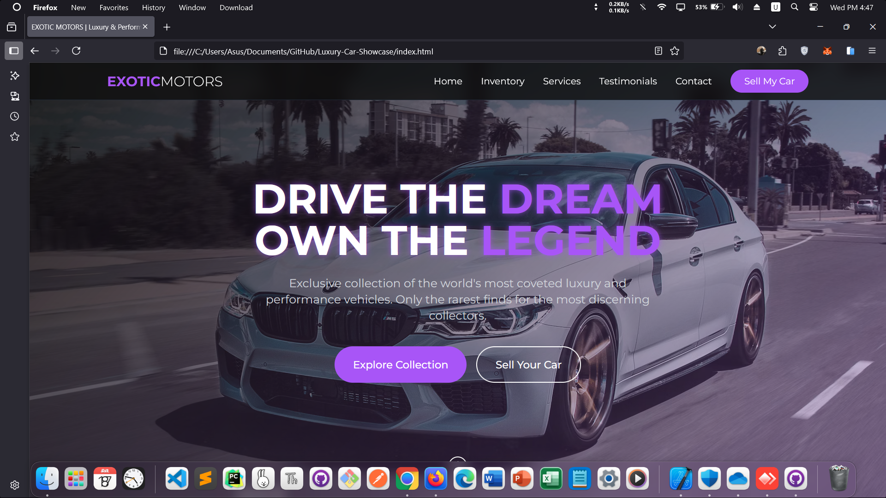

<!-- README.md -->

  <a href="https://amirhosseingholami-dev.github.io/Luxury-Car-Showcase/" target="_blank" style="text-decoration: none; color: inherit;">
    
    <h3>Luxury Car Showcase</h3>
  </a>

  A modern and visually appealing car website built with HTML, Tailwind CSS, and JavaScript.  
  Showcases luxury cars, offers related services, and enables user contact.  
  Features car collection exploration, company services, client testimonials, and contact forms.  
  Fully responsive with sleek animations, hover effects, and luxurious aesthetic.

  <a href="https://amirhosseingholami-dev.github.io/Luxury-Car-Showcase/" target="_blank">🎯 Live demo</a> ·
  <a href="https://github.com/AmirHosseinGholami-DEV/Luxury-Car-Showcase/" target="_blank">💻 Source</a>

